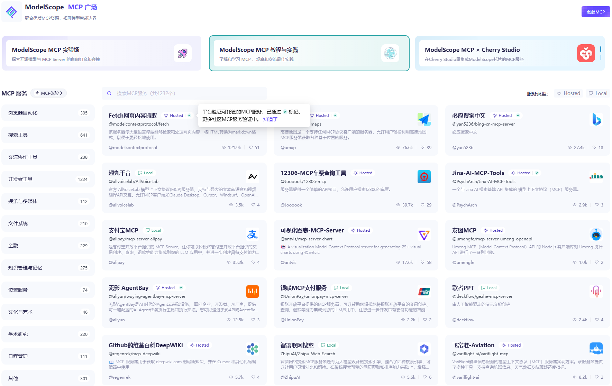
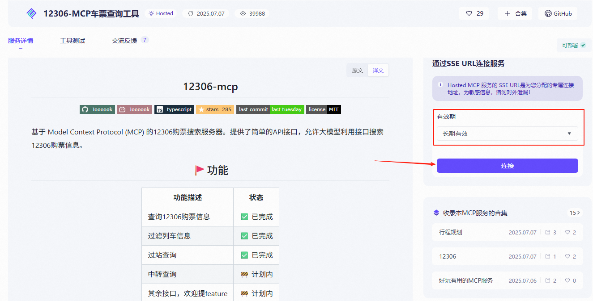
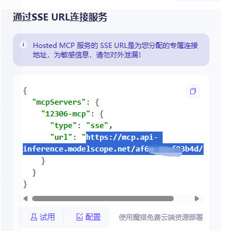

模型上下文协议（又名MCP）是一种为LLM提供工具和上下文的方法。来自MCP文档：

MCP是一个开放协议，它规范了应用程序如何向LLM提供上下文。将MCP想象成AI应用程序的USB-C端口。正如USB-C提供了一种将设备连接到各种外围设备和配件的标准化方式一样，MCP提供了一个将AI模型连接到不同数据源和工具的标准化方法。

openai-agents SDK支持MCP。这使您能够使用各种MCP服务器为您的代理提供工具。

就像HTTP中的客户端-服务器关系一样，MCP有一个客户端和一个服务器。

主机：终端用户直接与之交互的面向用户的人工智能应用程序。示例包括Anthropic的Claude Desktop、Cursor等人工智能增强的IDE、Hugging Face Python SDK等推理库，或LangChain或smolagents等库中内置的自定义应用程序。主机启动与MCP服务器的连接，并协调用户请求、LLM处理和外部工具之间的整体流程。
客户端：主机应用程序中管理与特定MCP服务器通信的组件。每个客户端与单个服务器保持1:1的连接，处理MCP通信的协议级细节，并充当主机逻辑和外部服务器之间的中介。
服务器：通过MCP协议公开功能（工具、资源、提示）的外部程序或服务。

许多内容交替使用“客户端”和“主机”。从技术上讲，主机是面向用户的应用程序，客户端是主机应用程序中管理与特定MCP服务器通信的组件。

来源：
https://huggingface.co/learn/mcp-course/unit1/key-concepts


通信流

1、用户交互：用户与主机应用程序交互，表达意图或查询。
2、主机处理：主机处理用户的输入，可能使用LLM来理解请求并确定可能需要哪些外部功能。
3、客户端连接：主机指示其客户端组件连接到相应的服务器。
4、能力发现：客户端查询服务器以发现它提供的功能（工具、资源、提示）。
5、能力调用：根据用户的需求或LLM的决定，主机指示客户端从服务器调用特定的能力。
6、服务器执行：服务器执行请求的功能并将结果返回给客户端。
7、结果集成：客户端将这些结果中继回主机，主机将它们合并到LLM的上下文中或直接呈现给用户。

这种架构的一个关键优势是它的模块化。单个主机可以通过不同的客户端同时连接到多个服务器。可以将新服务器添加到生态系统中，而无需更改现有主机。功能可以很容易地跨不同的服务器组合。这种模块化将传统的M×N集成问题（M个AI应用程序连接到N个工具/服务）转化为更易于管理的M+N问题，其中每个主机和服务器只需要实现一次MCP标准。

来源：
https://huggingface.co/learn/mcp-course/unit1/architectural-components


**模型上下文协议（MCP）的主要目的是什么？**
A 限制人工智能模型的训练数据
B 使AI模型能够与外部数据源、工具和环境连接
C 在使用大型语言模型时替换提示
D 为AI创建一种新的编程语言

答案：B
解释：MCP的主要目标是促进互操作性。

**MCP的主要目标是解决什么问题？**
A 缺乏人工智能模型
B 训练LLM的高昂成本
C M×N 集成问题
D 创建新的人工智能算法的困难

答案：C
解释：MCP对连接进行标准化，以避免M×N的自定义集成。

**以下哪一项是MCP的关键优势？**
A AI模型准确性降低
B 人工智能开发的复杂性增加
C 人工智能生态系统中的标准化和互操作性
D AI模型与外部系统的隔离

答案：C
解释：这是MCP的主要目标和优势。

**在MCP术语中，什么是“主机”？**
A 外部程序暴露功能
B 面向用户的AI应用程序
C 只读数据源
D 预定义的交互模板

答案：B
解释：主机是用户与之交互的应用程序。

**在人工智能应用的背景下，“M×N集成问题”指的是什么？**
A 用N个数据集训练M模型的难度
B 在没有标准的情况下将M个AI应用程序连接到N个外部工具的挑战
C 跨N个应用程序管理M个用户的问题
D 为N个不同的用户群体开发M个特征的复杂性

答案：B
解释：MCP提供了解决这种M*N复杂性的标准。

来源：
https://huggingface.co/learn/mcp-course/unit1/quiz1


通信协议

JSON-RPC：基础
MCP的核心是使用JSON-RPC 2.0作为客户端和服务器之间所有通信的消息格式。JSON-RPC是一种用JSON编码的轻量级远程过程调用协议，这使得它：
人类可读且易于调试
语言无关，支持在任何编程环境中实现
成熟，规格明确，广泛采用

该协议定义了三种类型的消息：
1.请求
从客户端发送到服务器以启动操作。请求消息包括：
唯一标识符（id）
要调用的方法名称（例如，工具/调用）
方法参数（如有）

2.答复
从服务器发送到客户端以回复请求。响应消息包括：
与相应的请求id相同
结果（表示成功）或错误（表示失败）

3.通知
不需要回复的单向消息。通常从服务器发送到客户端，以提供有关事件的更新或通知。


#### 传输机制
JSON-RPC定义了消息格式，但MCP还指定了如何在客户端和服务器之间传输这些消息。支持两种主要的传输机制：
- 标准输入/输出
stdio传输用于本地通信，其中客户端和服务器在同一台机器上运行：
Host应用程序将Server作为子进程启动，并通过写入其标准输入（stdin）和读取其标准输出（stdout）与之通信。
这种传输的用例是本地工具，如文件系统访问或运行本地脚本。
这种传输的主要优点是它简单，不需要网络配置，并且由操作系统安全地沙盒化。
- HTTP+SSE（服务器发送事件）/流式HTTP
HTTP+SSE传输用于远程通信，其中客户端和服务器可能位于不同的机器上：
通信通过HTTP进行，服务器使用服务器发送事件（SSE）通过持久连接向客户端推送更新。
此传输的用例是连接到远程API、云服务或共享资源。
这种传输的主要优点是它跨网络工作，能够与web服务集成，并且与无服务器环境兼容。
MCP标准的最新更新引入或改进了“流式HTTP”，它允许服务器在需要时动态升级到SSE进行流式传输，同时保持与无服务器环境的兼容性，从而提供了更大的灵活性。


**MCP SDK的主要目的是什么？**
A 定义MCP协议规范
B 更容易实现MCP客户端和服务器
C 为MCP交互提供可视化界面
D 取代对编程语言的需求

答案：B
解释：SDK抽象出低级协议细节。

**MCP SDK通常处理以下哪些功能？**
A 优化MCP服务器
B 定义新的人工智能算法
C 消息序列化/反序列化
D 托管大型语言模型
答案：C
解释：这是处理JSON-RPC消息的核心功能。

**哪家公司维护着MCP的官方Python SDK？**
A Google
B Anthropic
C 微软
D JetBrains

答案：B
解释：Anthropic维护Python SDK。

**使用名为server.py的Python文件启动开发MCP服务器时，使用了什么命令？**
A python server.py run
B mcp start server.py
C mcp dev server.py
D serve mcp server.py

答案：C
解释：此命令初始化开发服务器。

**JSON-RPC 2.0在MCP中的作用是什么？**
A 作为远程通信的主要传输机制
B 作为客户端和服务器之间所有通信的消息格式
C 作为调试AI模型的工具
D 作为定义人工智能功能（如工具和资源）的一种方法

答案：B
解释：MCP使用JSON-RPC 2.0来构造消息。


## MCP 代码实战

### MCP Servers

目前，MCP规范根据其使用的传输机制定义了三种服务器：
1. stdio服务器作为应用程序的子进程运行。你可以把它们看作是“本地”运行。
2. HTTP/SSE服务器远程运行。您通过URL连接到它们。
3. 流式HTTP服务器使用MCP规范中定义的流式HTTP传输远程运行。
您可以使用`MCPServerStdio`、`MCPServerSse`和`MCPServerStreamableHttp`类连接到这些服务器。

我们这个例子在本地运行一个SSE服务器，新建一个空白py文件：word.py
填入以下代码：
```python
import random
from mcp.server.fastmcp import FastMCP
# Create server
mcp = FastMCP("Secret Word")
@mcp.tool()
def get_secret_word() -> str:
    print("使用工具 get_secret_word()")
    return random.choice(["apple", "banana", "cherry"])
if __name__ == "__main__":
    mcp.run(transport="sse")
```

这样，一个MCP服务端的代码就写好了，运行 python word.py 
终端会输出：
```bash
INFO:     Started server process [14488]
INFO:     Waiting for application startup.
INFO:     Application startup complete.
INFO:     Uvicorn running on http://127.0.0.1:8000 (Press CTRL+C to quit)
```
这说明MCP服务端运行在http://127.0.0.1:8000/sse


### MCP Clients

MCP客户端是关键组件，充当AI应用程序（主机）和MCP服务器提供的外部功能之间的桥梁。将主机视为您的主要应用程序（如AI助手或IDE），将客户端视为该主机中负责处理MCP通信的专用模块。


我们再运行一个MCP 客户端，新建一个空白py文件：mcp_try.py
填入以下代码：
```python
from agents import Agent, Runner, set_tracing_disabled
from agents.extensions.models.litellm_model import LitellmModel
from agents.mcp import MCPServer, MCPServerSse
from agents.model_settings import ModelSettings
import os
from dotenv import load_dotenv
import asyncio
# 加载环境变量
load_dotenv()
# 从环境变量中读取api_key
api_key = os.getenv('mistral_key')
base_url = 'https://api.mistral.ai/v1'
chat_model = "mistral/mistral-small-latest"
set_tracing_disabled(disabled=True)
llm = LitellmModel(model=chat_model, api_key=api_key, base_url=base_url)

async def run(mcp_server: MCPServer):
    agent = Agent(
        name="Assistant",
        instructions="Use the tools to answer the questions.",
        model=llm,
        mcp_servers=[mcp_server],
        model_settings=ModelSettings(tool_choice="required"),
    )

    # Run the `get_secret_word` tool
    message = "What's the secret word?"
    print(f"\n\nRunning: {message}")
    result = await Runner.run(starting_agent=agent, input=message)
    print(result.final_output)


async def main():
    async with MCPServerSse(
        name="SSE Python Server",
        params={
            "url": "http://127.0.0.1:8000/sse",
        },
    ) as server:
        await run(server)


if __name__ == "__main__":
    asyncio.run(main())
```

运行 python mcp_try.py 后，终端输出：
Running: What's the secret word?
The secret word is "cherry".

同时，MCP 服务端会输出：
使用工具 get_secret_word()

这样我们分别建立了 MCP的服务端和客户端，并连接成功。


### 使用第三方MCP服务
MCP服务最大的好处是可以很方便的使用第三方提供的MCP服务。可以通过MCP市场快速接入各家MCP服务，这里推荐2个MCP市场

MCP市场：https://mcpmarket.cn/ （已收录23749个MCP Servers）

魔搭MCP广场：https://www.modelscope.cn/mcp （已收录4232个MCP Servers，可托管MCP服务）

#### 魔搭MCP的使用

魔搭MCP市场上的MCP服务分为两类，带`Hosted`标签的为在线托管服务，用户可以直接使用；带`Local`标签的为本地部署服务，用户需要自行部署。



这里以12306-MCP车票查询工具为例，介绍如何使用魔搭MCP市场的在线托管服务。

https://modelscope.cn/mcp/servers/@Joooook/12306-mcp

打开12306-MCP车票查询工具的页面，设置服务有效期，然后点击`连接`



接着会出现一个窗口，里面是MCP服务的JSON配置，但我们只需要url地址即可。这个地址应该像这样：
```plaintext
https://mcp.api-inference.modelscope.net/xxxxxxxxxxxxxx/sse
```





将获取到的MCP服务地址填入下面example代码中的`<填自己申请的MCP服务的SSE地址>`位置。
然后运行代码即可。
```python
import asyncio
from dotenv import load_dotenv

from agents import Agent, Runner, set_tracing_disabled
from agents.extensions.models.litellm_model import LitellmModel
from agents.mcp.server import MCPServerSse
from agents.model_settings import ModelSettings
from dotenv import load_dotenv
import os
# 加载环境变量
load_dotenv()
# 从环境变量中读取api_key
api_key = os.getenv('DEEPSEEK_API_KEY')
base_url = os.getenv('https://api.deepseek.com/v1')
chat_model = "deepseek/deepseek-chat"
set_tracing_disabled(disabled=True)
llm = LitellmModel(model=chat_model, api_key=api_key, base_url=base_url)

async def main():
    async with MCPServerSse(
        params={
            "url": "<填自己申请的MCP服务的SSE地址>",
        }
    ) as my_mcp_server: # 建议用这种上下文写法，否则需要手动连接和关闭MCP服务。
        agent = Agent(
            name="Assistant",
            instructions="你是一个火车票查询助手，能够查询火车票信息。",
            mcp_servers=[my_mcp_server],
            model_settings=ModelSettings(tool_choice="required"),
            model=llm,
        )

        message = "明天从广州到杭州可以买哪些火车票？"
        print(f"Running: {message}")
        result = await Runner.run(starting_agent=agent, input=message)
        print(result.final_output)


if __name__ == "__main__":
    asyncio.run(main())
```
运行代码后，终端会输出类似以下内容：

```plaintext
Running: 明天从广州到杭州可以买哪些火车票？
以下是明天从广州到杭州的部分火车票信息：

1. **K512**
   - 出发时间: 07:52 (广州白云)
   - 到达时间: 04:24 (杭州南)
   - 历时: 20小时32分钟
   - 无座: 有票，价格 189.5元

2. **K528**
   - 出发时间: 08:19 (广州白云)
   - 到达时间: 01:49 (杭州南)
   - 历时: 17小时30分钟
   - 软卧: 剩余1张票，价格 508.5元
   - 无座: 有票，价格 173.5元

3. **G818**
   - 出发时间: 08:27 (广州南)
   - 到达时间: 14:16 (杭州东)
   - 历时: 5小时49分钟
   - 无座: 无票，价格 793元

4. **G1184**
   - 出发时间: 08:43 (广州南)
   - 到达时间: 17:28 (杭州西)
   - 历时: 8小时45分钟
   - 无座: 无票，价格 840元

5. **G3068**
   - 出发时间: 09:09 (广州东)
   - 到达时间: 15:58 (杭州西)
   - 历时: 6小时49分钟
   - 一等座: 剩余4张票，价格 1260元
   - 无座: 有票，价格 796元

请注意，以上仅为部分列车信息，具体的票务情况可能会有所变化。建议尽快购票以确保行程。
```


#### MCP的使用（本地部署）
在本地部署MCP服务的关键，是要有能运行MCP服务的环境。通常会使用Python或NodeJS来运行MCP服务，并用uvx(Python)、npx(NodeJS)、docker打包运行环境配置并一键运行MCP服务。

本地部署 MCP 服务时选择这三者，核心是从环境打包与适配角度解决不同场景需求：uvx 为 Python 类 MCP 服务打包并快速调用 Python 依赖环境，npx 为 NodeJS 类 MCP 服务打包并直接启用 NodeJS 依赖环境，docker 则将 MCP 服务及所有运行依赖（含语言环境、库、配置）整体打包成独立容器，三者分别覆盖单语言轻量环境打包与跨语言全环境打包需求，确保服务能在对应环境中稳定启动。

举个例子，假设我们要运行这个MCP服务：https://mcpmarket.cn/server/685a2f3c7aaa700924977a5e
它会给出以下配置：
```json
{
  "mcpServers": {
    "markitdown": {
      "command": "docker",
      "args": [
        "run",
        "--rm",
        "-i",
        "markitdown-mcp:latest"
      ]
    }
  }
}
```
这个的意思是，让MCP Client在调用该MCP服务时，使用`docker run --rm -i markitdown-mcp:latest`命令来启动一个程序，并通过stdio管道与该程序进行交互，而这就是MCP协议stdio通讯的方式。
在使用这个MCP服务之前，你需要先在本地安装Docker。

同理，如果看到这个配置，你就需要意识到其对应的运行指令为`npx -y @larksuiteoapi/lark-mcp mcp -a <your_app_id> -s <your_app_secret>`，并且需要先安装NodeJS环境。

```json
{
  "mcpServers": {
    "lark-mcp": {
      "command": "npx",
      "args": [
        "-y",
        "@larksuiteoapi/lark-mcp",
        "mcp",
        "-a",
        "<your_app_id>",
        "-s",
        "<your_app_secret>"
      ]
    }
  }
}
```

这里放下这3个常用的MCP服务运行环境安装文档，具体怎么安装就略了。

**npx(NodeJS) 安装**：https://nodejs.org/zh-cn/download

**uvx(Python) 安装**：https://uv.doczh.com/getting-started/installation/ 

**Docker 安装**：https://docs.docker.com/engine/install/


接着我们在代码中试一下运行本地文件服务的MCP接口，在此之前请安装好NodeJS。若网络超时则切换nodejs为国内镜像源再试

```
# 给NodeJS设置淘宝镜像源 
npm config set registry https://registry.npmmirror.com/
```

本地文件服务的MCP接口对应的openai agent SDK的stdio接口是这个。
```python
async with MCPServerStdio(
    params={
        "command": "npx",
        "args": ["-y", "@modelcontextprotocol/server-filesystem", "D:/学习资料"],
    }
) as my_mcp_server:
    pass
```
下面是运行代码

> 建议运行之前手动执行 npx -y @modelcontextprotocol/server-filesystem D:/学习资料
> 完成MCP初始化，其中"D:/学习资料"替换成你电脑实际存在的路径

```python
import asyncio
from dotenv import load_dotenv

from agents import Agent, Runner, set_tracing_disabled
from agents.extensions.models.litellm_model import LitellmModel
from agents.mcp.server import MCPServerStdio
from agents.model_settings import ModelSettings

# 加载环境变量
load_dotenv()
# 从环境变量中读取api_key
api_key = os.getenv('DEEPSEEK_API_KEY')
base_url = os.getenv('https://api.deepseek.com/v1')
chat_model = "deepseek/deepseek-chat"
set_tracing_disabled(disabled=True)
llm = LitellmModel(model=chat_model, api_key=api_key, base_url=base_url)
samples_dir = r"E:\夏令营\复杂推理"


async def main():
    async with MCPServerStdio(
        params={
            "command": "npx",
            "args": ["-y", "@modelcontextprotocol/server-filesystem", samples_dir],
        }
    ) as my_mcp_server: # 建议用这种上下文写法，否则需要手动连接和关闭MCP服务。
        agent = Agent(
            name="Assistant",
            instructions="你是一个文件系统助手，能够查询文件系统信息。",
            mcp_servers=[my_mcp_server],
            model_settings=ModelSettings(tool_choice="required"),
            model=llm,
        )

        message = "现在这个目录下有哪些文件？"
        print(f"Running: {message}")
        result = await Runner.run(starting_agent=agent, input=message)
        print(result.final_output)


if __name__ == "__main__":
    asyncio.run(main())
```
运行结果大概是这样

```bash
Running: 现在这个目录下有哪些文件？
在目录 `E:\\夏令营\\复杂推理` 下有以下文件：

1. `baseline.py`
2. `baseline.py.zip`
3. `round1_test_data.jsonl`
4. `round1_test_data.jsonl.zip`
5. `round1_train_data - Copy.jsonl`
6. `round1_train_data.jsonl`
7. `round1_train_data.jsonl.zip`
```
