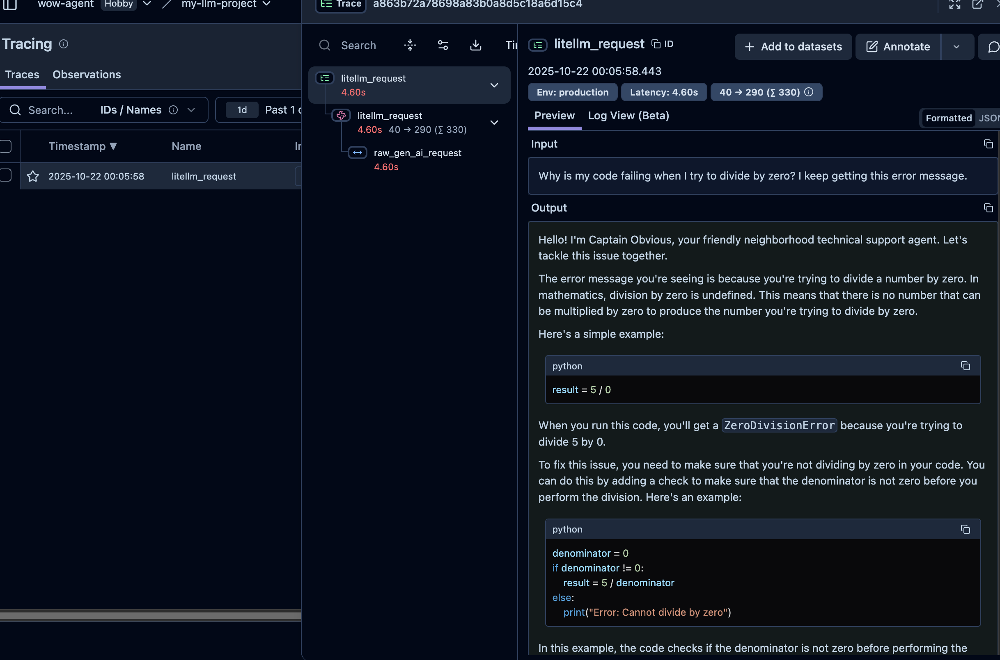

# 追踪功能
Agents SDK 内置了追踪功能，能够全面记录智能体运行期间的所有事件：包括大模型生成内容、工具调用、交接流程、防护机制触发以及自定义事件等。通过 Traces 控制面板，您可以在开发和生产环境中调试、可视化监控工作流程。

追踪功能默认启用。如需禁用可通过以下两种方式：

1、通过设置环境变量 OPENAI_AGENTS_DISABLE_TRACING=1 全局关闭追踪功能
2、针对单个程序文件禁用追踪：将agents.set_tracing_disabled 中的 disabled 参数设为True
3、针对单次运行禁用追踪：将 agents.run.RunConfig.tracing_disabled 设为 True

### 追踪与跨度
1. Traces（追踪记录） 表示一个完整"工作流"的端到端操作，由多个 Span 组成。追踪记录包含以下属性：
- workflow_name：表示逻辑工作流或应用名称，例如"代码生成"或"客户服务"
- trace_id：追踪记录的唯一标识符。若未提供将自动生成，必须符合 trace_<32_alphanumeric> 格式
- group_id：可选分组 ID，用于关联同一会话中的多个追踪记录（例如聊天线程 ID）
- disabled：若为 True，则该追踪记录不会被保存
- metadata：追踪记录的元数据（可选）


2. Spans（跨度） 表示具有起止时间的操作单元。跨度包含：
- started_at 和 ended_at 时间戳
- 所属追踪记录的 trace_id
- 指向父级跨度的 parent_id（如存在）
- 记录跨度详情的 span_data。例如 AgentSpanData 包含智能体信息，GenerationSpanData 包含大模型生成信息等

### 默认追踪项
SDK 默认追踪以下内容：

整个 Runner.{run, run_sync, run_streamed}() 会被包裹在 trace() 中
每次智能体运行时会被包裹在 agent_span()
大模型生成内容会被包裹在 generation_span()
函数工具调用会被分别包裹在 function_span()
防护机制触发会被包裹在 guardrail_span()
交接流程会被包裹在 handoff_span()
语音输入（语音转文字）会被包裹在 transcription_span()
语音输出（文字转语音）会被包裹在 speech_span()
相关音频跨度可能归属于同一个 speech_group_span()
默认追踪记录命名为"Agent trace"。使用 trace 可自定义名称，或通过 RunConfig 配置名称及其他属性。

此外，您可以设置 自定义追踪处理器 将追踪数据推送至其他目标（作为替代或补充存储）。

### 高阶追踪
若需将多次 run() 调用归入同一条追踪记录，可使用 trace() 包裹相关代码。

```python
from agents import Agent, Runner, trace

async def main():
    agent = Agent(name="Joke generator", instructions="Tell funny jokes.")

    with trace("Joke workflow"): 
        first_result = await Runner.run(agent, "Tell me a joke")
        second_result = await Runner.run(agent, f"Rate this joke: {first_result.final_output}")
        print(f"Joke: {first_result.final_output}")
        print(f"Rating: {second_result.final_output}")
```

### 自定义追踪处理器

利用 set_trace_processors() 可替换默认处理器

我们把默认处理器换成langsmith。

先安装langsmith。

pip install "langsmith[openai-agents]"


您可以使用OpenAIAgentsTracingProcessor类将LangSmith追踪与OpenAI 智能体 SDK集成。
```python
import asyncio
from agents import Agent, Runner, set_trace_processors
from langsmith.wrappers import OpenAIAgentsTracingProcessor
from agents.extensions.models.litellm_model import LitellmModel
import os
from dotenv import load_dotenv

# 加载环境变量
load_dotenv()
# 从环境变量中读取api_key
api_key = os.getenv('mistral_key')
base_url = 'https://api.mistral.ai/v1'
chat_model = "mistral/mistral-small-latest"
llm = LitellmModel(model=chat_model, api_key=api_key, base_url=base_url)

async def main():
    agent = Agent(
        name="Captain Obvious",
        instructions="You are Captain Obvious, the world's most literal technical support agent.",
        model=llm,
    )

    question = "Why is my code failing when I try to divide by zero? I keep getting this error message."
    result = await Runner.run(agent, question)
    print(result.final_output)

if __name__ == "__main__":
    set_trace_processors([OpenAIAgentsTracingProcessor()])
    asyncio.run(main())
```

上面会报错：
Failed to multipart ingest runs: langsmith.utils.LangSmithAuthError: Authentication failed for https://api.smith.langchain.com/runs/multipart. HTTPError('401 Client Error: Unauthorized for url: https://api.smith.langchain.com/runs/multipart', '{"error":"Unauthorized"}\n')trace=2dd6cc33-8229-41f9-8e8f-a3d8e4981fdd,id=2dd6cc33-8229-41f9-8e8f-a3d8e4981fdd; trace=2dd6cc33-8229-41f9-8e8f-a3d8e4981fdd,id=a9a14ae2-f4f4-4434-b57d-75c8ab16607e

由于这段代码是langsmith云托管的追踪，所以要求openai key。我们有机会的时候探索本地部署langsmith，然后把追踪信息导入本地的langsmith。这个作为附加题，如果有朋友能够实现这一功能，欢迎供稿合并到本教程。

### langfuse追踪
langfuse是一款开源的对标langsmith的追踪工具，也是适配litellm的，考虑litesmith不能免费本地部署且不开源的性质，我们可以尝试使用langfuse

langfuse的官网为：https://langfuse.com/

langfuse的适配方式和langsmith有所区别，我们先安装依赖
```bash
pip install "langfuse[openai-agent]" "opentelemetry-api[openai-agent]" "opentelemetry-sdk[openai-agent]" "opentelemetry-exporter-otlp[openai-agent]"
```

然后您可以根据喜好，注册langfuse cloud账号或者本地部署langfuse，我们需要在这个过程中获得API_KEY和HOST

接下来我们配置.env环境
```env
LANGFUSE_PUBLIC_KEY=pk-lf-****
LANGFUSE_SECRET_KEY=****
# HOST默认是欧洲区，这时候可以不填，如果是本地默认配置部署,则可以填http://localhost:3000,这里我们使用美区cloud
LANGFUSE_HOST=https://us.cloud.langfuse.com
```

尝试调整一下我们上面的代码：
```python
import asyncio
from agents import Agent, Runner 
from agents.extensions.models.litellm_model import LitellmModel
import os
from dotenv import load_dotenv
import litellm

# 加载环境变量
load_dotenv()

# 接入langfuse
litellm.callbacks = ["langfuse_otel"]

# === Langfuse 配置 ===
# 确保 .env 中有：
# LANGFUSE_PUBLIC_KEY=...
# LANGFUSE_SECRET_KEY=...
# LANGFUSE_HOST=http://localhost:3000 （如果是本地部署）或留空（用官方云EU源）
# 这里不需要手动初始化 Langfuse，LiteLLM 会自动读取环境变量

# 从环境变量中读取 Mistral API key
api_key = os.getenv('mistral_key')
base_url = 'https://api.mistral.ai/v1'
chat_model = "mistral/mistral-small-latest"
llm = LitellmModel(model=chat_model, api_key=api_key, base_url=base_url)

async def main():
    agent = Agent(
        name="Captain Obvious",
        instructions="You are Captain Obvious, the world's most literal technical support agent.",
        model=llm,
    )

    question = "Why is my code failing when I try to divide by zero? I keep getting this error message."
    result = await Runner.run(agent, question)
    print(result.final_output)

if __name__ == "__main__":
    # 移除 set_trace_processors 调用（不再需要）
    asyncio.run(main())
```

如果配置都没错的话，那么我们可以在自己API_KEY对应的项目上从Tracing看到自己的请求过程:
